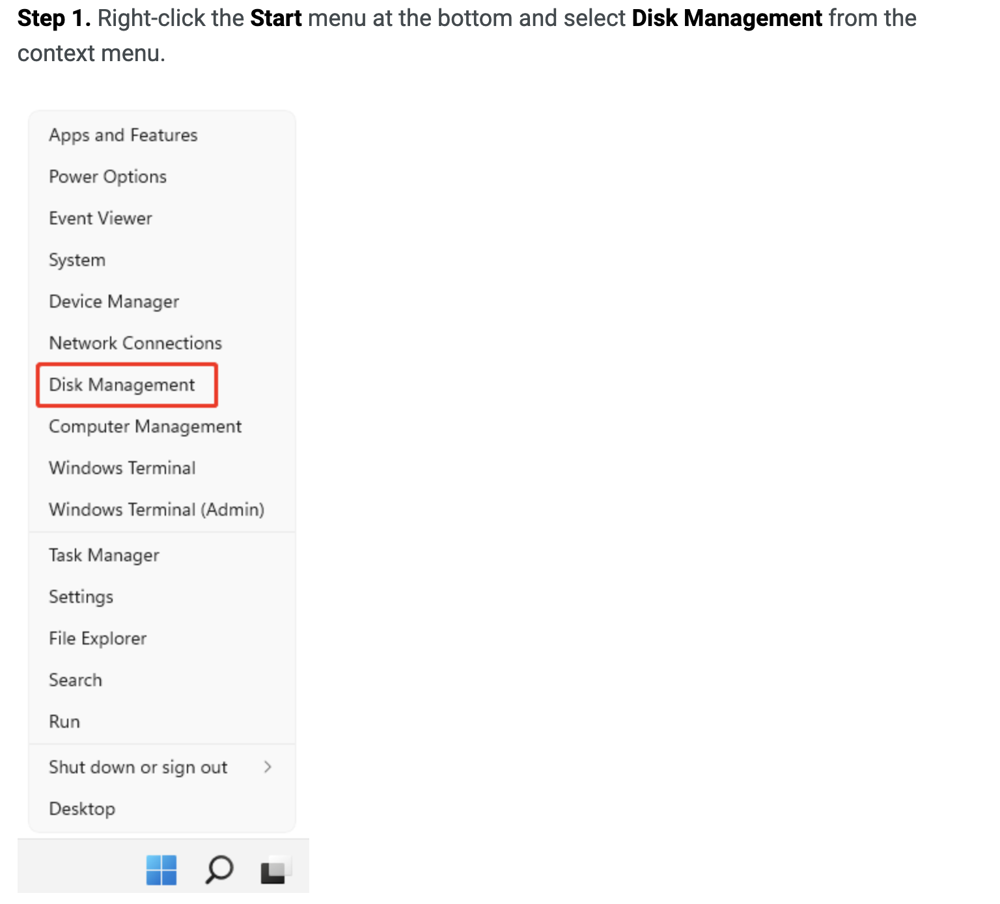
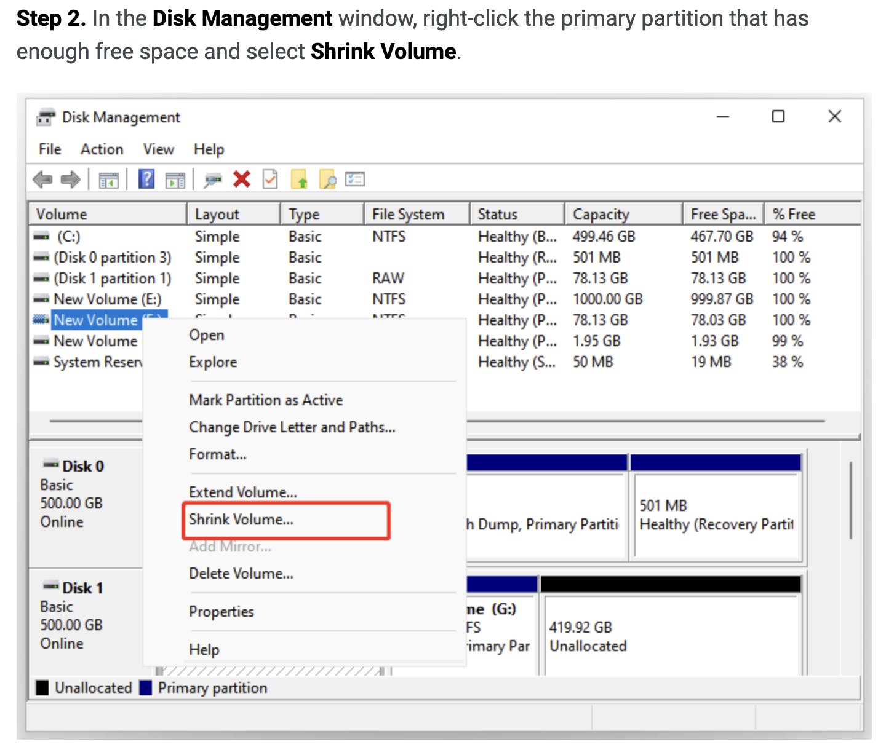
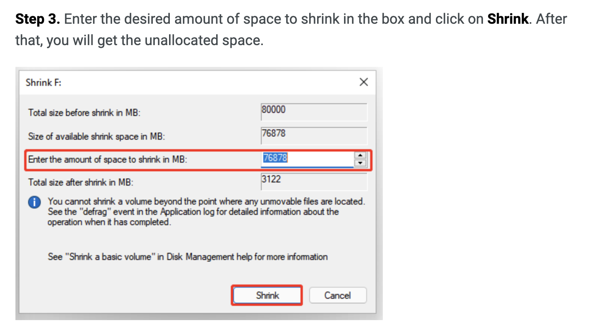
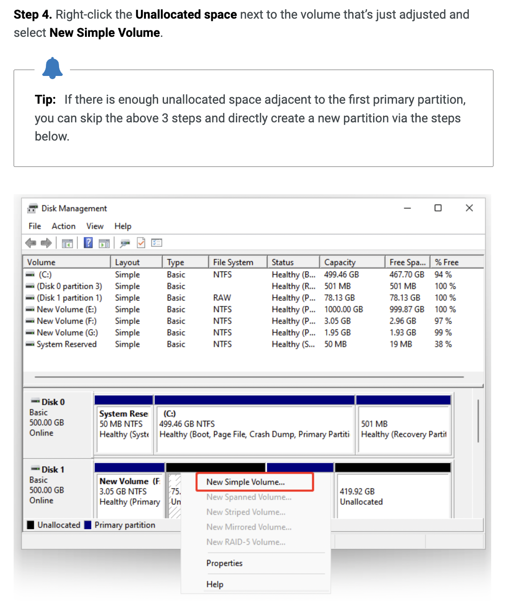
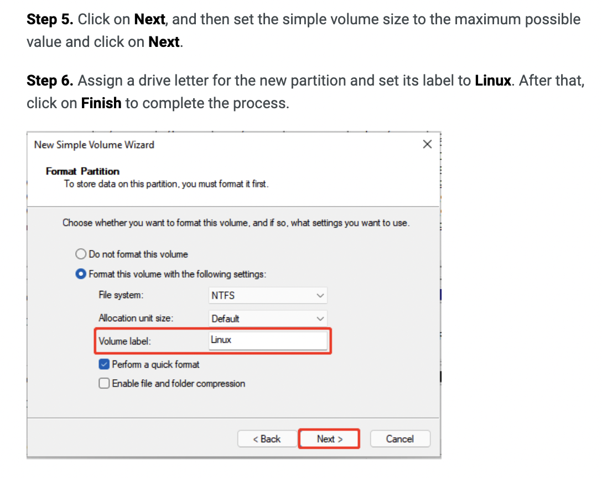

# How to install linux

Sources: [https://gist.github.com/cjonesy/2e2d8ca5e50ee1811f70](https://gist.github.com/cjonesy/2e2d8ca5e50ee1811f70)

## Download ubuntu
[https://ubuntu.com/download/desktop](https://ubuntu.com/download/desktop)

**Convert .ios to .img if install on mac**
```bash
	hdiutil convert -format UDRW -o ~/ubuntu.img 
	~/Downloads/ubuntu-15.10-desktop-amd64.iso
```
## Partition disk

### Windows











### Mac

1. Open Disk Utility in MacOS
2. Choose Macintosh HD on the left side of the window
3. Click on Partition on the right side of the window
4. Click the + to add a new partition
5. Resize the new partition and choose to leave it as free space


## Create USB boot
[https://www.balena.io/etcher/](https://www.balena.io/etcher/)

## Reboot
Windows : Hold F2
Mac: Hold Option key 

## Follow install instruction