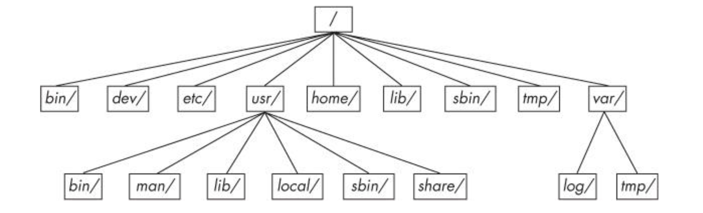

# Basic
## Spaces
- **User space**: shell, services, servers, gui.
- **Kernel space**: system calls, process, memory manament, device drivers.

## System calls
 - **fork()**: create a identical copy of a process
 - **exec()**: start program, replace current

## Enviroment
 - **$PATH**: A command path is a list of system directories that the shell searches when trying to locate a command.
 
 Add path: `PATH=dir:$PATH`

## Directory hierachy
 

# Devices

## Folder
- /dev
- /sys/devices
- /sys/dev
- /sys/block

## Files
- b: Block as Disk device
- c: Character, perform read or write operation
- p: Like character, with another process at the other end of the I/O stream instead of a kernel driver
- s: Socket

## Query devices
`udevadm info --query=all --name=/dev/nvmen01`

`dmesg`

`cat /proc/devices`

Query disk: `lsscsi`

Query sub: `lsusb`

# File system

# Folder
/proc/partitions

## Partitions
Query partitions :`parted -l`

## Filesytem types
ext2, ext3, ext4, ntfs, fat

## Create fs
`mkfs -t ext4 /dev/nvmen02`

## Mount
### Create mount
`mount -t type device mountpoint`

ex: `mount -t ext4 /dev/nvme01 ~/windows`

### Unmount
`umount mountpoint`

ex: `mount ~/windows`

## Filesystem uuid
### Query
`blkid`

### Filesytem table
/etc/fstab

## Filesystem capacity
`df`

# System boot
**GRUB** **Config**:  /boot/grub

# Systemd
## Folder
/etc/systemd/system

## Commands

List unit: `systemctl list-units`

Get status: `systemctl status unit`

Start unit: `systemctl start unit`

Stop unit: `systemctl stop unit`

Enable unit: `systemctl enable unit`.
Enable a unit if unit has [Install] section and it create a folder

Disable unit: `systemctl disable unit`

Get logs: `journalctl _SYSTEMD_UNIT=unit`

# Configuration
## System log
Folder: /var/log

Config: /etc/rsyslog.conf

## User management
Folder: /etc/passwd, /etc/shadow

Config: /etc/sudoers

Commands: vipw, visudo

## Cron
Commands: crontab

Rules: 

1. [0-59] Minute
2. [0-23] Hour
3. [1-31] Day of month
4. [1-12] Month
5. [0-7]	Day of week, 0 and 7 means Sunday
6. **\*** any
7. **,** more than 2 times
8. **-** range of values
9. **/** step values

`* * * * * [commmand]`

Ex: [https://crontab.guru/](https://crontab.guru/)

# Monitor
## File open
`lsof`

## System call
`strace [command]`

## Processes
`ps auxm`
`top`
`time [command]`
`uptime`

## Memory
Folder: /proc/meminfo

Commands:

`free`
`vmstat`

## IO
`iostat`
`iotop`

# Network
Folder: 

/etc/hosts - manual overide hosts

/etc/resolv.conf - DNS server config

/etc/network | /etc/sysctl.conf - network config 

/etc/services - well known ports

/etc/bind – the default bind9 configuration file path

/var/cache/bind – working directory for named that contains transient file generated by it

/etc/bind/named.conf – the primary configuration file for bind9

Commands:

`ifconfig`: show interfaces

`route -n`: show routing table

`traceroute`: show routes

`dig` `nslookup`:query ip

- DNS cache: bind9

`netstat`

`tcpdump`

`iptables`: NAT, firewall

`arp`: ARP protocol

`iw`: wireless

# Package manager
## Install package
`sudo apt intall package`
## Install .deb
`sudo dpkg -i *.deb`
`sudo apt install *.deb`

## Apt sources list
Folder: /etc/apt/sources.list, /etc/apt/sources.list.d

```
deb http://site.example.com/debian distribution component1 deb-src

deb-src http://site.example.com/debian distribution component1
```

## Update apt
`sudo aptupdate`

## Upgrade package
`sudo apt upgrade package`

## Remove package
`sudo apt remove package`

## Apt key
`sudo apt-key list`